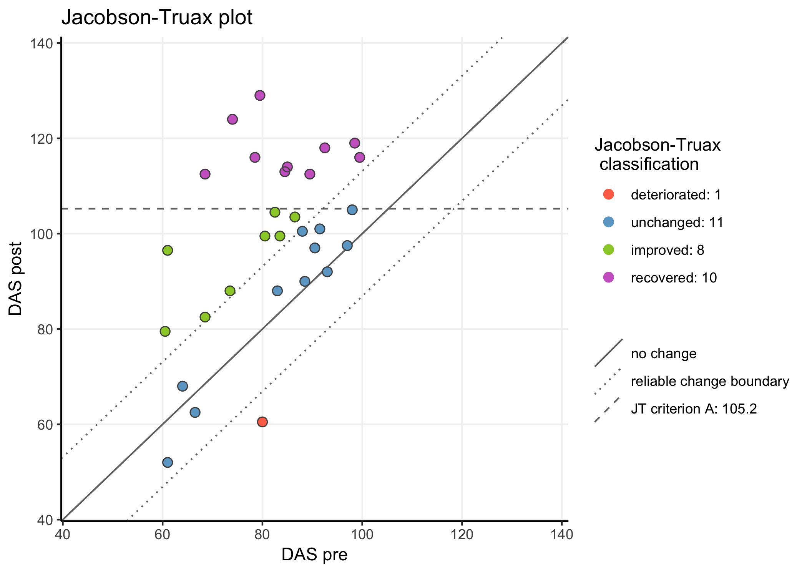
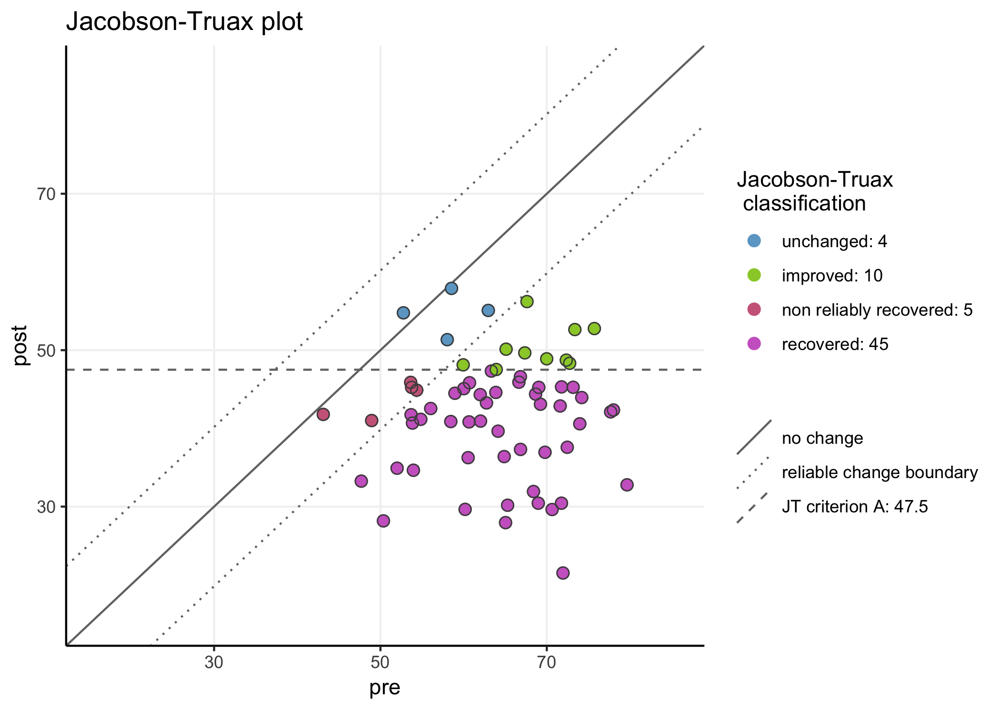
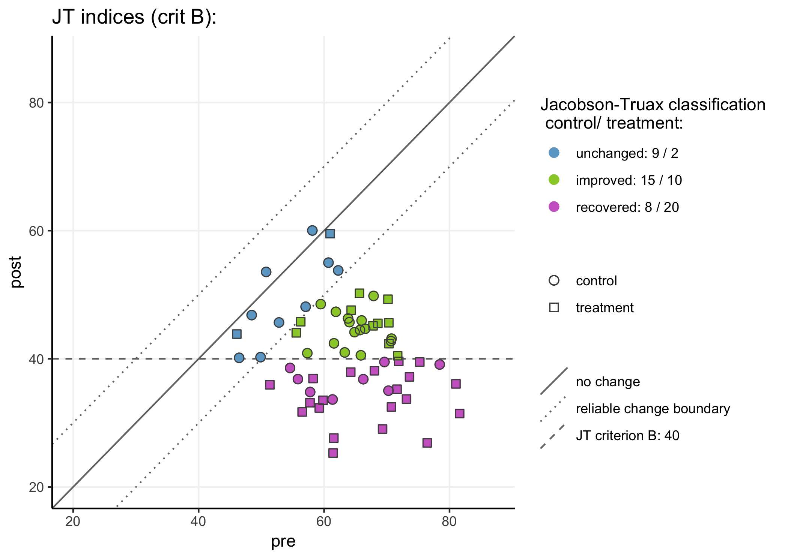

JTRCI: Jacobson-Truax & reliable change indices
================

<!-- README.md is generated from README.Rmd. Please edit that file -->

Example plot using the Dyadic Adjustment Scale (DAS) data provided in
table 2 by Jacobson & Truax
(1991).



*notice that this is a ‘higher is better’ measure*

-----

to install JTRCI, first install package devtools from CRAN - either
through the ‘install packages’ interface (in for instance Rstudio) or
using the following line:

``` r
install.packages("devtools")
```

then install JTRCI from github:

``` r
devtools::install_github("AWKruijt/JT-RCI")

library(JTRCI)
```

-----

JRTCI() is the main function in this package:

JTRCI (data = NA, pre = NA, post = NA, ppid = NA, group = NA,  
            reliability = NA, higherIsBetter = F, indextype = “JT”,
JTcrit = “auto”,  
            normM = NA, normSD = NA, dysfM = NA, dysfSD = NA,  
            plot = T, table = T, …)

It requires data in wide format (one row per individual) and an estimate
of the measure reliability to be given through parameter ‘reliability
=’.

The reliability estimate can be based on norm data. Alternatively, the
internal reliability of the measure observed in the current data can be
used. In that case, the user will first need to obtain their estimate of
choice (alpha, omega, x-random splits splithalf reliability) using the
raw (item level) data.

Obtaining reliable change indices is pretty straightforward: run the
function with parameter ‘indextype = “RCI”’. The JTRCI function’s
default setting is to obtain Jacobson-Truax indices (‘indextype =
“JT”’). The function is designed to provide guidance through the
various choices a researcher has to make when applying the
Jacobson-Truax method. It is recommended to pay attention to the various
output messages.

An online dashboard using essentially the same code is available at:
<https://awkruijt.shinyapps.io/JTRCI_dashboard/> It allows the user to
upload their own data (as a .csv file) or to test things using
generated/mock data. JTRCI plots and dataframes can subsequently be
downloaded.

An example of a more advanced plot (with multiple follow-ups) based on
the JTRCI-outputs can be found here:
<https://awkruijt.netlify.com/plotposts/longitudinaljtrci>

#### examples:

``` r
# generate some random data:
df <- cbind.data.frame("ppid" = seq(1:64), 
                       "pre" = rnorm(64, 65, 8), 
                       "post" = rnorm(64, 45, 8), 
                       "group" = rep(c("treatment", "control"), 32))
```

Obtain and plot Jacobson-Truax indices using parameter JTcrit =
“auto”

``` r
# The function will determine which criterion to use based on the available information 
# f.i. when no (healthy or dysfunctional) norm values are provided, the function will  
# return criterion A using the baseline distribution as the 'dysfunctional distribution':

JTRCI(data = df, 
      ppid = "ppid", 
      pre = "pre", 
      post = "post",  
      group = "group", 
      reliability = .8, 
      indextype = "JT", 
      JTcrit = "auto")
```

    ## Assumed that lower scores are better (and reduction == improvement),
    ##  if that is incorrect: set higherIsBetter = T

    ## NB: using the sample baseline distribution to characterize the dysfunctional population. 
    ##     to change: provide norms for dysfunctional population using 'dysfM =' and 'dysfSD ='

    ## Jacobson-Truax criterion A: 47.2

    ##  this value represents two sd from the baseline total sample mean

    ## 2 participants scored below the Jacobson-Truax cut-off score at the pre-measurement 
    ##  interpret their Jacobson-Truax classification with caution

    ##    Jacobson Truax classification  N
    ## 1:                     unchanged 10
    ## 2:                      improved 12
    ## 3:        non reliably recovered  4
    ## 4:                     recovered 38



Obtain reliable change indices by setting parameter indextype = “RCI”:

``` r
# obtain reliable change indices 
# also disable plotting with plot = F:
JTRCI(data = df, pre = "pre", post = "post", group = "group", ppid = "ppid",
      reliability = .8, indextype = "RCI",  table = F, plot = F)
```

    ## Assumed that lower scores are better (and reduction == improvement),
    ##  if that is incorrect: set higherIsBetter = T

Subsequently plot the RCI with a separate call to
plot\_RCI():

``` r
# plot the reliable change indices obtained in the previous chunk - set x y and plot labels:

plot_RCI(xlab = "score pre", ylab = "score post", plottitle = "my reliable change plot")
```


Parameters for the plot\_JT()/plot\_RCI() functions can also be passed
directly in the JTRCI() function:

``` r
# obtain and plot Jacobson-Truax indices using criterion B. 

JTRCI(data = df, pre = "pre", post = "post",  group = "group", ppid = "ppid",
      reliability = .8, indextype = "JT", JTcrit = "B",
      normM = 35, normSD = 5, 
      useGroups = T, plottitle = "JT indices (crit B):")
```

    ## Assumed that lower scores are better (and reduction == improvement),
    ##  if that is incorrect: set higherIsBetter = T

    ## NB: using the sample baseline distribution to characterize the dysfunctional population. 
    ##     to change: provide norms for dysfunctional population using 'dysfM =' and 'dysfSD ='

    ## NB criterion C is recommended when the baseline distribution overlaps with the norm distribution

    ## Jacobson-Truax criterion B: 45

    ##  this value represents two sd from the functional/healthy population norm mean

    ##    Jacobson Truax classification  N
    ## 1:                     unchanged 11
    ## 2:                      improved 17
    ## 3:        non reliably recovered  3
    ## 4:                     recovered 33



``` r
# obtain Jacobson-Truax indices using criterion C.
# plot with parameter facetplot = T

JTRCI(data = df, pre = "pre", post = "post",  group = "group", ppid = "ppid",
      reliability = .8, indextype = "JT", JTcrit = "C",
       normM = 35, normSD = 5, dysfM = 60, dysfSD = 5, 
      facetplot = T, addJitter = F, plottitle = "JT indices by group:")
```

    ## Assumed that lower scores are better (and reduction == improvement),
    ##  if that is incorrect: set higherIsBetter = T

    ## Jacobson-Truax criterion C:45.8

    ##  this value represents the weighted midpoint between the dysfunctional and functional norm mean, 
    ##  i.e. the value at which an individual is equally likely to belong to the functional as to the dysfunctional population

    ## 1 participants scored below the Jacobson-Truax cut-off score at the pre-measurement 
    ##  interpret their Jacobson-Truax classification with caution

    ##    Jacobson Truax classification  N
    ## 1:                     unchanged 11
    ## 2:                      improved 14
    ## 3:        non reliably recovered  3
    ## 4:                     recovered 36


