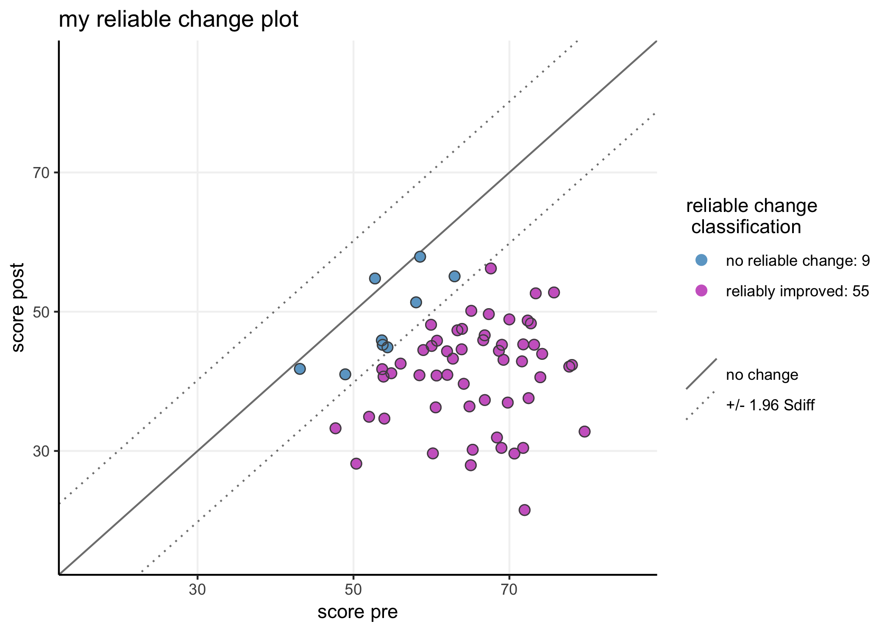

JTRCI: Jacobson-Truax & reliable change indices
================

<!-- README.md is generated from README.Rmd. Please edit that file -->

Example plot using the Dyadic Adjustment Scale (DAS) data provided in
table 2 by Jacobson & Truax
(1991).


*notice that this is a ‘higher is better’ measure*

## 

to install JTRCI, first install package devtools from CRAN - either
through the ‘install packages’ interface (in for instance Rstudio) or
using the following line:

``` r
install.packages("devtools")
```

then install JTRCI from github:

``` r
devtools::install_github("AWKruijt/JT-RCI")

library(JTRCI)
```

# 

JRTCI() is the main function in this package:

   JTRCI (data = NA, pre = NA, post = NA, ppid = NA, group = NA,  
               reliability = NA, higherIsBetter = F, indextype = “JT”,
JTcrit = “auto”,  
               normM = NA, normSD = NA, dysfM = NA, dysfSD = NA,  
               plot = T, table = T, …)

It requires data in wide format (one row per individual) and an estimate
of the measure reliability to be given through parameter ‘reliability
=’.

The reliability estimate can be based on norm data. Alternatively, the
internal reliability of the measure observed in the current data can be
used. In that case, the user will first need to obtain their estimate of
choice (alpha, omega, x-random splits splithalf reliability) using the
raw (item level) data.

Obtaining reliable change indices is pretty straightforward: run the
function with parameter ‘indextype = “RCI”’. The JTRCI function’s
default setting is to obtain Jacobson-Truax indices (‘indextype =
“JT”’). The function is designed to provide guidance through the
various choices a researcher has to make when applying the
Jacobson-Truax method. It is recommended to pay attention to the various
output messages.

# 

When plot = T (default), the JTRCI() function will call on either the
JTplot() or RCIplot().

The JTplot()/RCIplot() functions take the following parameters:

   plotJT(data = JTRCIdf, useGroups = F, facetplot = F, addJitter = F,  
             xlab = “pre”, ylab = “post”, plottitle = “Jacobson-Truax
plot”,  
             addInfoLegend = c(“yes”, “classcounts”, “JTcrit”, “no”))

The plot parameters can also be passed directly into a call on JTRCI()
(see examples below)

# 

An online dashboard using essentially the same code is available at:
<https://awkruijt.shinyapps.io/JTRCI_dashboard/> It allows the user to
upload their own data (as a .csv file) or to test things using
generated/mock data. JTRCI plots and dataframes can subsequently be
downloaded.

An example of a more advanced plot (with multiple follow-ups) based on
the JTRCI-outputs can be found here:
<https://awkruijt.netlify.com/plotposts/longitudinaljtrci>

# 

#### examples:

``` r
# generate some random data:
df <- cbind.data.frame("ppid" = seq(1:64), 
                       "pre" = rnorm(64, 65, 8), 
                       "post" = c(rnorm(32, 40, 8), rnorm(32, 45, 8)),
                       "group" = rep(c("treatment", "control"), each = 32))
```

Obtain and plot Jacobson-Truax indices using parameter JTcrit =
“auto”

``` r
# The function will determine which criterion to use based on the available information 
# f.i. when no (healthy or dysfunctional) norm values are provided, the function will  
# return criterion A using the baseline distribution as the 'dysfunctional distribution':

JTRCI(data = df, 
      ppid = "ppid", 
      pre = "pre", 
      post = "post",  
      reliability = .8, 
      indextype = "JT", 
      JTcrit = "auto")
```

    ## Assumed that lower scores are better (and reduction == improvement),
    ##  if that is incorrect: set higherIsBetter = T

    ## NB: using the sample baseline distribution to characterize the dysfunctional population. 
    ##     to change: provide norms for dysfunctional population using 'dysfM =' and 'dysfSD ='

    ## Jacobson-Truax criterion A: 51.6

    ##  this value represents two sd from the baseline  sample mean

    ## 2 participants scored below the Jacobson-Truax cut-off score at the pre-measurement 
    ##  interpret their Jacobson-Truax classification with caution

    ##    Jacobson-Truax classification  N
    ## 1:                  deteriorated  0
    ## 2:                     unchanged  3
    ## 3:                      improved  2
    ## 4:        non reliably recovered  2
    ## 5:                     recovered 57


Obtain reliable change indices by setting parameter indextype = “RCI”:

``` r
# obtain reliable change indices 
# disable table and plot with 'table = F' & 'plot = F'
JTRCI(data = df, pre = "pre", post = "post", group = "group", ppid = "ppid",
      reliability = .8, indextype = "RCI",  table = F, plot = F)
```

    ## Assumed that lower scores are better (and reduction == improvement),
    ##  if that is incorrect: set higherIsBetter = T

Subsequently plot the RCI with a separate call to
plot\_RCI():

``` r
# plot the reliable change indices obtained in the previous chunk - set x y and plot labels:

plotRCI(xlab = "score pre", ylab = "score post", plottitle = "my reliable change plot", useGroups = F)
```



and obtain RCI tables by calling tableRCI():

``` r
tableRCI(useGroups = F)
```

    ##    reliable change classification  N
    ## 1:          reliably deteriorated  0
    ## 2:             no reliable change  5
    ## 3:              reliably improved 59

``` r
tableRCI(useGroups = T)
```

    ##    reliable change classification control treatment
    ## 1:          reliably deteriorated       0         0
    ## 2:             no reliable change       3         2
    ## 3:              reliably improved      29        30

Parameters for the plot\_JT()/plot\_RCI() functions can also be passed
directly in the JTRCI() function:

``` r
# obtain and plot Jacobson-Truax indices using criterion B 
# Crit B requires functional/healthy norm data passed as 'normM =' and 'normSD='. 
# set 'useGroups = T' to show group membership in the plot - JTplot() can handle up to 5 groups
# add jittering of the points with addJitter = T
# pass a custom plottitle with parameter 'plottitle = '

JTRCI(data = df, pre = "pre", post = "post",  group = "group", ppid = "ppid",
      reliability = .8, indextype = "JT", JTcrit = "B",
      normM = 30, normSD = 5, 
      useGroups = T, addJitter = T, plottitle = "JT indices (crit B):")
```

    ## Assumed that lower scores are better (and reduction == improvement),
    ##  if that is incorrect: set higherIsBetter = T

    ## NB: using the sample baseline distribution to characterize the dysfunctional population. 
    ##     to change: provide norms for dysfunctional population using 'dysfM =' and 'dysfSD ='

    ## NB criterion C is recommended when the baseline distribution overlaps with the norm distribution

    ## Jacobson-Truax criterion B: 40

    ##  this value represents two sd from the functional/healthy population norm mean

    ##    Jacobson-Truax classification control treatment
    ## 1:                  deteriorated       0         0
    ## 2:                     unchanged       3         2
    ## 3:                      improved      18        15
    ## 4:        non reliably recovered       0         0
    ## 5:                     recovered      11        15


Plot groups in separate facets:

``` r
# obtain Jacobson-Truax indices using criterion C
# Crit C requires both 'functional' and 'dysfunctional' norm data: 
# these are passed as 'normM =', 'normSD=', 'dysfM =' and 'dysfSD ='. 
# plot with parameter facetplot = T 

JTRCI(data = df, pre = "pre", post = "post",  group = "group", ppid = "ppid",
      reliability = .8, indextype = "JT", JTcrit = "C",
       normM = 30, normSD = 5, dysfM = 60, dysfSD = 5, 
      facetplot = T, plottitle = "JT indices by group:")
```

    ## Assumed that lower scores are better (and reduction == improvement),
    ##  if that is incorrect: set higherIsBetter = T

    ## Jacobson-Truax criterion C:44.9

    ##  this value represents the weighted midpoint between the dysfunctional and functional norm mean, 
    ##  i.e. the value at which an individual is equally likely to belong to the functional as to the dysfunctional population

    ##    Jacobson-Truax classification control treatment
    ## 1:                  deteriorated       0         0
    ## 2:                     unchanged       3         1
    ## 3:                      improved      12         7
    ## 4:        non reliably recovered       0         1
    ## 5:                     recovered      17        23


It is important to note that when assessing/plotting Jacobson-Truax
indices for multiple groups, the function treats the groups as one group
for the calculation of the RCI (when using baseline characteristics as
the ’dysfunctional distribution), or uses one single set of inputs dysfM
and dysfSD as characteristic of the dysfunctional population. I.e. it
assumes that all participants originate from the same (sub)population
and were randomly assigned to the different groups/conditions.

Generally speaking (regardless of number of groups), Jacobson-Truax
indices are designed for use with participants selected so that they
would be expected to score high (or low in case of a higher-is-better
measure) on the measure assessed. For a control group in which most/all
participants score already within the ‘functional’ (norm) range the
traditional Jacobson-Truax classification labels make little sense:
i.e. someone who scored in the healthy range at both the pre- and the
post-assessment would be classified as ‘recovered’ without an actual
recovering happening. The JTRCI() function will issue a message if any
participant scored below the JT criterion at baseline.

If such cases occur and are problematic, the more ‘simple’ reliable
change indices can be used (set parameter ‘indextype = “RCI”’). Reliable
change indices can also be used for comparison of groups preselected to
(likely) differ at baseline on the measure assessed.

I’ve also taken the liberty of adding a new label to the Jacobson-Truax
classification to indicate a sequence of events seen in the data that
this code was originally developed for: participants who dropped below
the JT-criterion at post, but did not actually show a pre-post change
sufficiently large to be classified as reliable change (i.e. they scored
already close to the JT-criterion value at basline). Such participants
are labeled ‘non-reliably recovered’.
